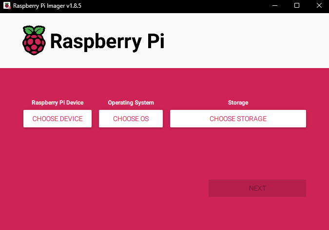

Raspberry Pi
============

Use
---

To use the Raspberry Pi, you must first make sure that you connect the 
appropriate power supply, 5V @ 1A. This should be achieved by connecting the Raspberry
Pi to the Type-C connector wired to the buck down converter.

.. note::
    Please make sure the input power to the Raspberry Pi is to specification. Both undervoltage and
    overvoltage will permanently damage the board.

Flashing the SD Card
--------------------

Before starting, please download the `Official Raspberry PI Imager <https://www.raspberrypi.com/software/>`__. 

Once installed and launched, choose the model number of your Raspberry PI for the device, "Raspberry PI OS (64-bit)" for the operating system,
and the inserted SD card for your storage device.

.. note::
    By flashing your SD card, the contents saved on the device will be permanently erased. Be sure to back up any files
    and data to a seperate storage device.
